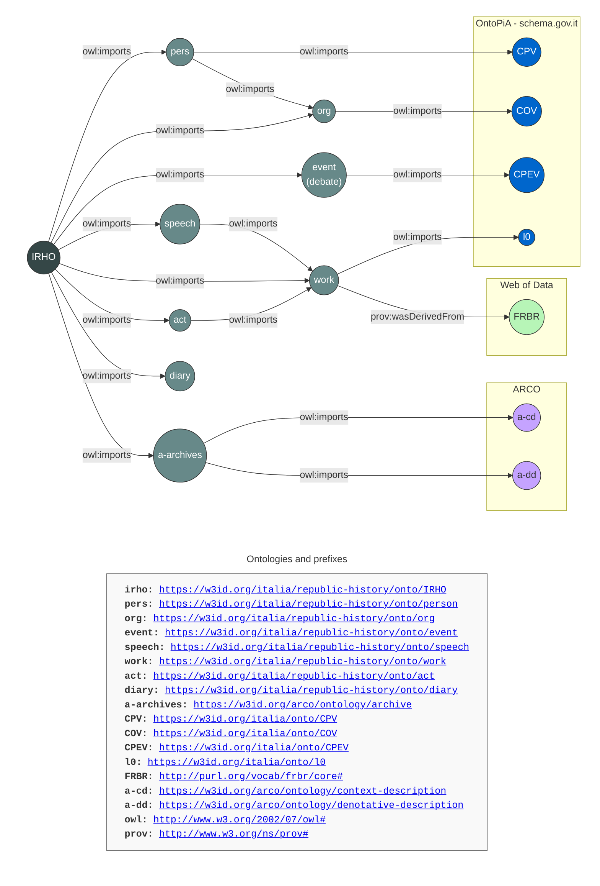
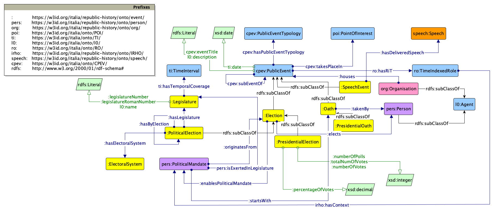
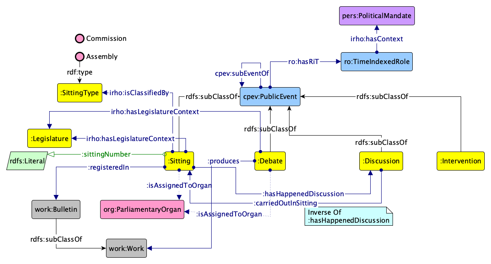
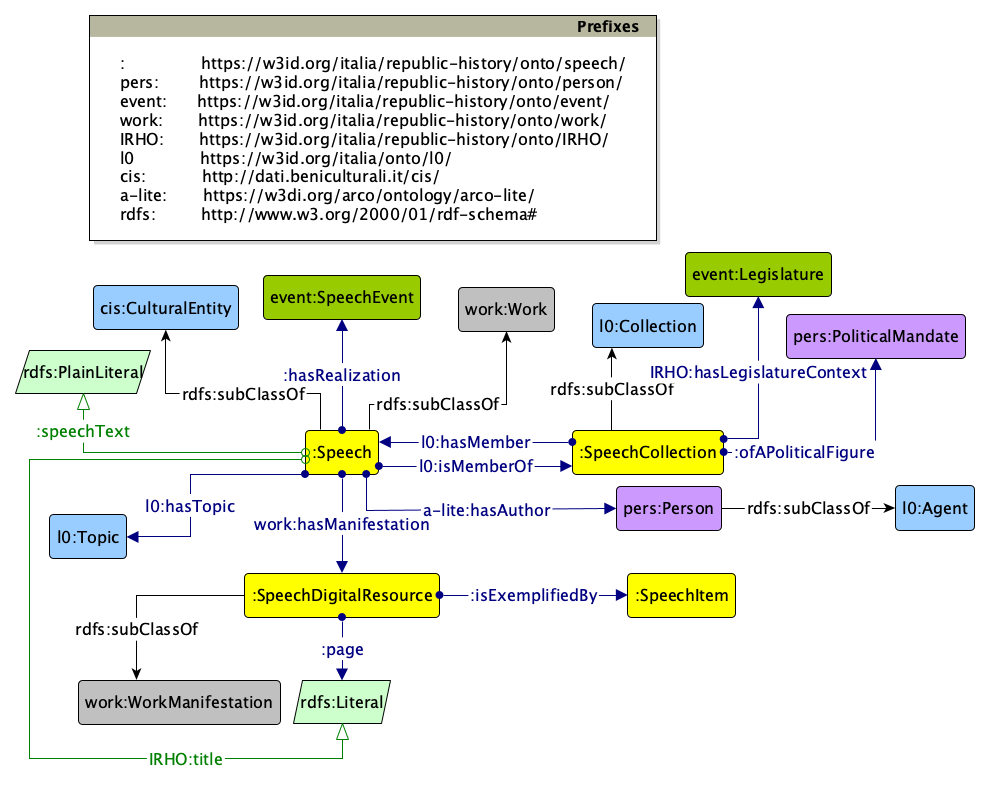
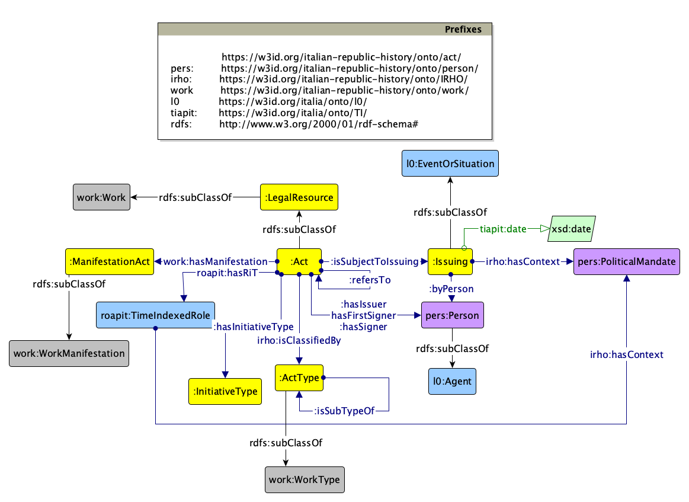
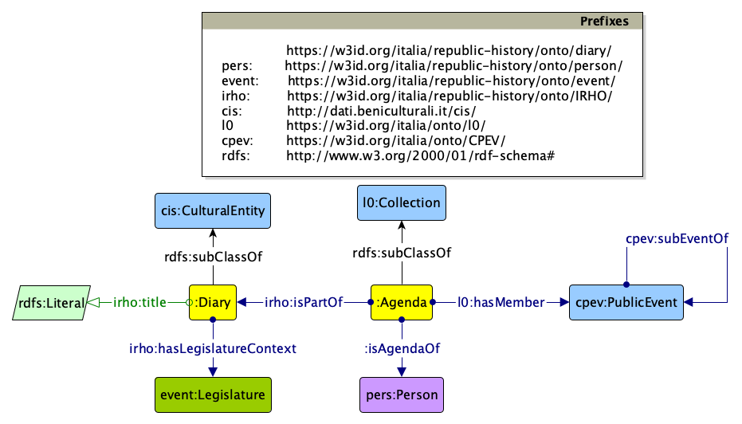
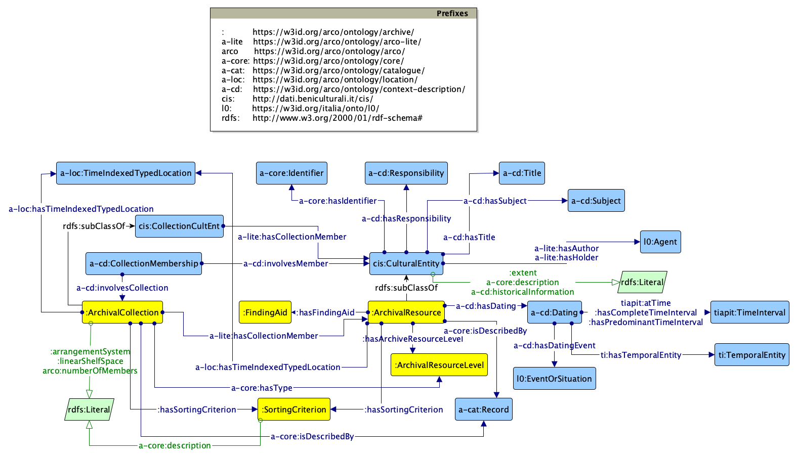

**Scegli la lingua / Choose your language**

[](README.md)
[](README.en.md)

# Semantic assets for the *Portal of sources for the history of the Italian Republic*


## Overview

This repository hosts the **ontology modules** that make up the **ontology network** designed and developed as part of the initiative to build the [Portal of sources for the history of the Italian Republic](https://portalefontirepubblicaitaliana.cnr.it/) (in Italian, *Portale delle fonti per la storia della Repubblica italiana*).

The portal is built upon data structured as a **semantic knowledge graph**, following the Linked Open Data paradigm. The ontology network defines the reference semantic models for representing and interlinking people, organizations, events, archival resources, and all other entities relevant to the domain. These models provide the semantic foundation of the portal's knowledge graph, enabling the integration of data from heterogeneous sources and supporting their publication as **Linked Open Data**.

### About the Portal

The [Portal of sources for the history of the Italian Republic](https://portalefontirepubblicaitaliana.cnr.it/) is a project coordinated by the **Italian National Research Council (CNR)** and aimed at providing a standards-based, interoperable digital infrastructure designed to aggregate, harmonise, and expose a distributed corpus of heterogeneous resources representing the body of sources related to the political and institutional history of Italy's republican period.

The portal integrates and harmonises these diverse datasets through the definition of a reference ontology network, making them accessible within the context of both public and private archives documenting aspects of the history of the Italian Republic. These resources are interoperable and machine-readable, and include archival documents as well as complementary entities such as organisations, legislative acts, and other materials related to the political context in which these documents were produced.

### Core data sources

Various institutions and public bodies (the Historical Archives of the Presidency of the Italian Republic, the Historical Archives of the Senate of the Italian Republic, the Historical Archives of the Italian Chamber of Deputies, and the Italian Central Archives of the State), together with a group of foundations and cultural institutes affiliated with the *Association of Italian Cultural Institutions* ([AICI](https://www.aici.it/)), have made available their portals, databases, and information systems providing descriptions and digitizations of parts of their archival holdings and domain data (also as Linked Open Data). These contributions have driven the design of the ontological models and the population of the knowledge graph supporting the portal.

Some of the reference data portals that have informed the ontology design process and constitute key data sources for specific domains within the portal’s knowledge graph include:
* [The open data portal of the Historical Archives of the Presidency of the Italian Republic](https://archivio.quirinale.it/aspr/)
* [The open data portal of the Italian Chamber of Deputies](https://dati.camera.it/en)
* [The open data portal of the Senate of the Italian Republic](https://dati.senato.it/)
* [The open data portal of the Italian Central Archives of the State](http://dati.acs.beniculturali.it/)

## Repository Structure

This repository is organized to support the full lifecycle of ontology engineering. For the ontology modules we follow a modular and explicit versioning pattern to ensure backward compatibility and stable URI resolution for the ontology network.

```text
assets/
└── ontologies/                  # Root for all OWL-serialized ontology modules
    ├── [module-name]/           # e.g., IRHO, person, event, diary
    │   ├── v0.1/                # Specific version snapshot
    │   ├── v0.2/
    │   ├── ...
    │   ├── latest/              # Copy of the most recent stable release
    │   │   ├── module.owl       # OWL RDF/XML serialization
    │   │   ├── module.rdf       # RDF/XML serialization
    │   │   └── module.ttl       # Turtle serialization
    │   └── Grafici/             
    │       ├── module.graphml   # Source of the Graffoo diagram
    │       └── module.png       # Graffoo diagram
    └── ...
```

📂 [`ontologies/`](./ontologies)

It is the core of the repository with the **ontology modules**. Each module is partitioned by version. The `latest/` directory always contains the current stable release, including multiple serializations (Turtle, RDF/XML, etc.). Graphical representations are also provided in the form of [Graffoo](https://essepuntato.it/graffoo/) diagrams. These diagrams provide the formal visual mapping of classes, properties, and axioms, serving as the primary visual design reference.

## The Ontology Network

The ontology network for the portal is designed as a modular network of interconnected ontologies, ensuring a separation of concerns while maintaining a unified view of the different knowledge areas and domain data. The semantic architecture follows a multi-layered approach, balancing specialized domain knowledge with cross-domain interoperability and the reuse of existing ontologies.



### Italian Republic History Ontology (IRHO)

**URI**: [`https://w3id.org/italia/republic-history/onto/IRHO`](https://w3id.org/italia/republic-history/onto/IRHO)

The Italian Republic History Ontology (IRHO) constitutes the core ontology of the network and serves as its main entry point, importing and integrating all the ontology modules developed within the framework. It defines a set of foundational, cross-domain classes and properties — such as title, short name, and other common descriptive elements — that are shared and reused across the network.

The rest of the network is organized into thematic modules that correspond to the primary data dimensions of the reference domain.

### (Public) Person Ontology

**URI**: [`https://w3id.org/italia/republic-history/onto/person`](https://w3id.org/italia/republic-history/onto/person)

 person ontology")

This ontology models individuals with public relevance, particularly those holding or having held political mandates. It supports the representation of different roles and positions through the application of established design patterns, aligned with those already adopted in existing national ontologies. The module enables a structured and reusable modeling of political and institutional roles and membership over time, in the context of specific (political) organisations.

### (Political) Organisation Ontology

**URI**: [`https://w3id.org/italia/republic-history/onto/org`](https://w3id.org/italia/republic-history/onto/org)

 organisation ontology")

This ontology models different types of organisations within a constitutional and political context, including entities such as political parties, parliamentary groups, and similar institutional actors. It provides a structured representation of their roles and classifications within the political system.

### Public Event Ontology

**URI**: [`https://w3id.org/italia/republic-history/onto/event`](https://w3id.org/italia/republic-history/onto/event)





This ontology reuses the national CPEV ontology to represent significant events within the project domain. It enables the modelling of institutional and political events such as the election and inauguration of the President of the Republic, parliamentary sessions, speeches, debates, and other relevant public events.

### (Creative) Work Ontology

**URI**: [`https://w3id.org/italia/republic-history/onto/work`](https://w3id.org/italia/republic-history/onto/work)

 work ontology")

This ontology module operates as a meta-level layer designed to group more abstract concepts primarily derived from the FRBR (Functional Requirements for Bibliographic Records) model, with which it is semantically aligned. It covers entities related to creative works and documentary resources produced by institutional actors, as well as their physical manifestations. In particular, it provides the structural framework for connecting and organising domain-specific resources such as parliamentary bulletins, presidential speeches, and legally binding acts, including laws and other legislative documents.

### Speech Ontology

**URI**: [`https://w3id.org/italia/republic-history/onto/speech`](https://w3id.org/italia/republic-history/onto/speech)



This ontology models speeches delivered by individuals within specific events and institutional contexts. It also enables the representation of associated digital resources, understood as the physical manifestations of the speeches themselves. The module supports the linking of speakers, events, and speech content in a structured and semantically consistent way.

### Act Ontology

**URI**: [`https://w3id.org/italia/republic-history/onto/act`](https://w3id.org/italia/republic-history/onto/act)



This ontology models legislative acts and laws, including all relevant information about their enactment, such as context, temporal period, and involved persons. It introduces the concept of a Legal Resource, aligned with the European Legislation Identifier (ELI) ontology, which is used for defining persistent identifiers in official legal publications such as the Official Gazette. A Legal Resource may also represent a component of a broader legal act, such as an individual article within a law, enabling fine-grained representation of legislative structures.

### Diary Ontology

**URI**: [`https://w3id.org/italia/republic-history/onto/diary`](https://w3id.org/italia/republic-history/onto/diary)



This ontology models historical diaries and related documentary materials, such as the diaries of the Presidents of the Republic. A diary is treated as a cultural heritage entity composed of an agenda, understood as a structured collection of public events. The module supports the representation of diaries as curated cultural artefacts linking temporal records and institutional activities.

### Archive Ontology

**URI**: [`https://w3id.org/arco/ontology/archive`](https://w3id.org/arco/ontology/archive)



The archive ontology is fully integrated into the [ArCo ontology network](https://github.com/ICCD-MiBACT/ArCo) developed by the Italian Ministry of Culture and is therefore maintained within that ecosystem. By reusing the domain-independent components provided by ArCo — such as dates, places, and responsibility structures — it ensures strong semantic alignment with national cultural heritage standards. The module extends this foundation with archive-specific concepts, including `ArchivalResource`, `ArchivalResourceCollection`, and the archival hierarchy, enabling the structured representation of archival entities and their internal organisation.


## Contributing and community engagement

We welcome contributions from domain experts and the Semantic Web community to help improve the ontology network. Anyone is free to contribute by identifying errors or inconsistencies, suggesting new terms, or proposing improvements to the models.

To ensure all changes are tracked and discussed transparently, we encourage using **GitHub Issues** as primary communication channel.

* **Report a bug:** Notice an inconsistency in an OWL module or a broken link?
* **Suggest an improvement:** Have an idea for a more descriptive property or a new class?
* **Request a feature:** Need an extension to support a specific use case?

To contribute or ask your question, **[open a new issue](https://github.com/PortaleFontiRepubblica/assets/issues/new/choose)** in this repository. Please provide as much detail as possible.

## Governance and Maintenance

The ontologies in this repository were designed and developed by the Italian National Research Council, with a strong collaboration between:
* the **Institute of Cognitive Sciences and Technologies** ([CNR-ISTC](https://www.istc.cnr.it/en)), primarily responsible for the ontology design and knowledge engineering process
* the **Institute for Applied Mathematics and Information Technologies "Enrico Magenes"** ([CNR-IMATI](https://www.imati.cnr.it/make_home_page.php?language=ENG))
* the **Institute for the European Intellectual Lexicon and History of Ideas** ([CNR-ILIESI](https://www.iliesi.cnr.it/?lan=en))

To ensure that these assets remain a reliable foundation for the community:

* **Long-term maintenance:** CNR is committed to the long-term maintenance and sustainability of the semantic assets beyond the initial project lifecycle.
* **URI persistence:** All namespaces and identifiers are managed to ensure permanent resolution within the Linked Data ecosystem, relying on the [w3id.org](https://w3id.org/) service and the specific [italia](https://github.com/perma-id/w3id.org/tree/master/italia) subdomain focusing on ontologies and controlled vocabularies of the Italian Public Sector.
* **Institutional support:** As the host of the portal, CNR provides the institutional stability necessary to keep the underlying infrastructure fully operational.

## License

[](https://creativecommons.org/licenses/by/4.0/)

Ontology modules and realted documentation are licensed under the [Creative Commons Attribution 4.0 International (CC BY 4.0)](https://creativecommons.org/licenses/by/4.0/) license.