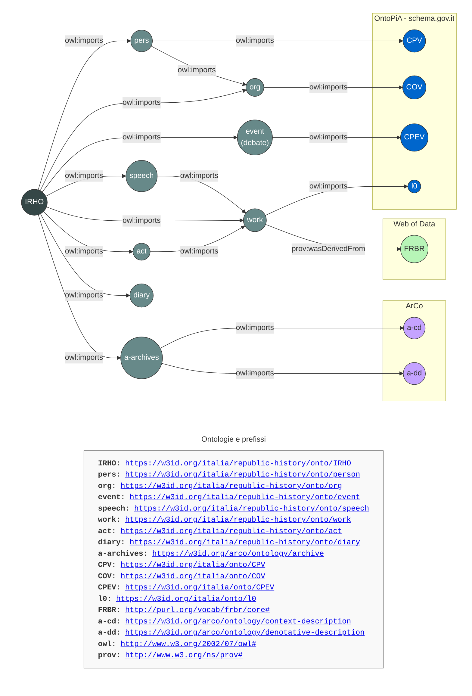
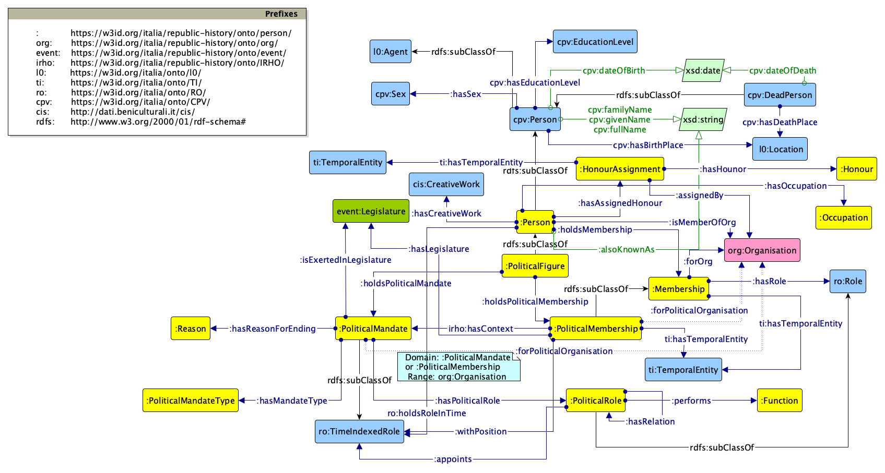
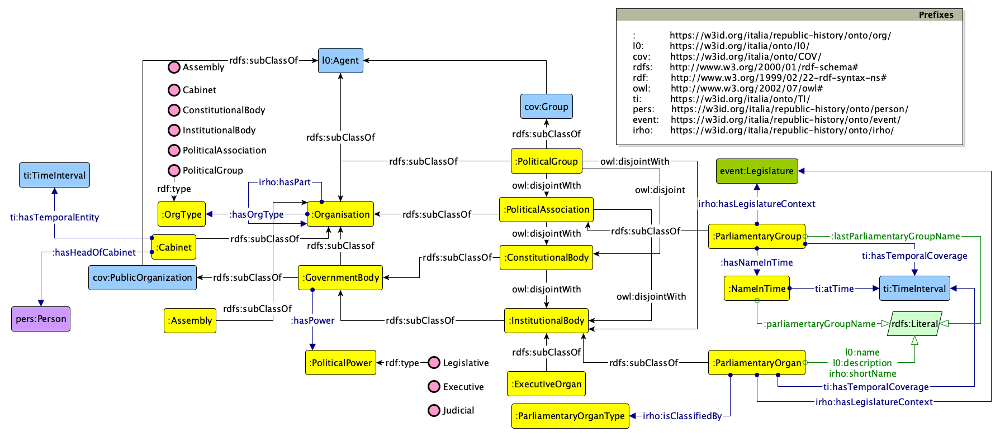
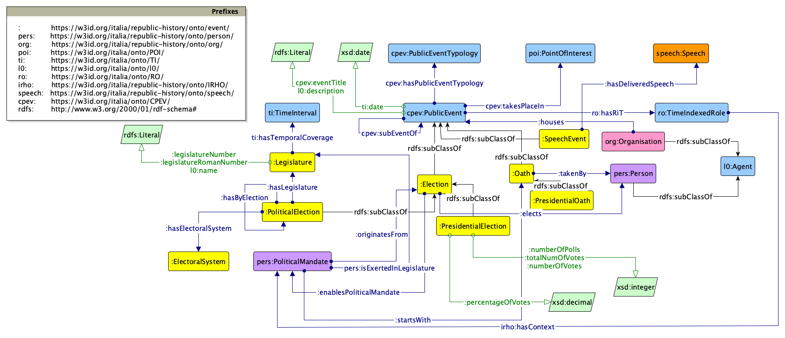
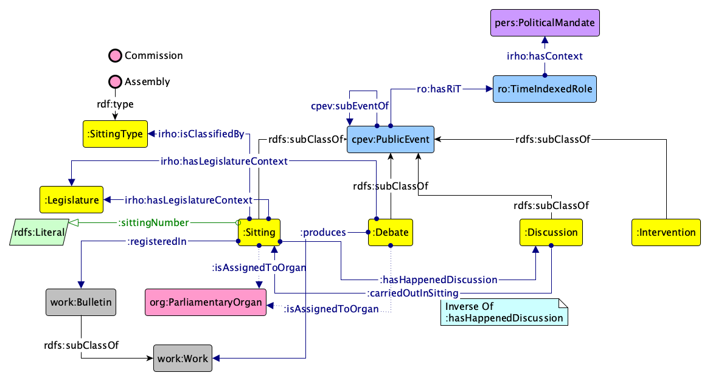
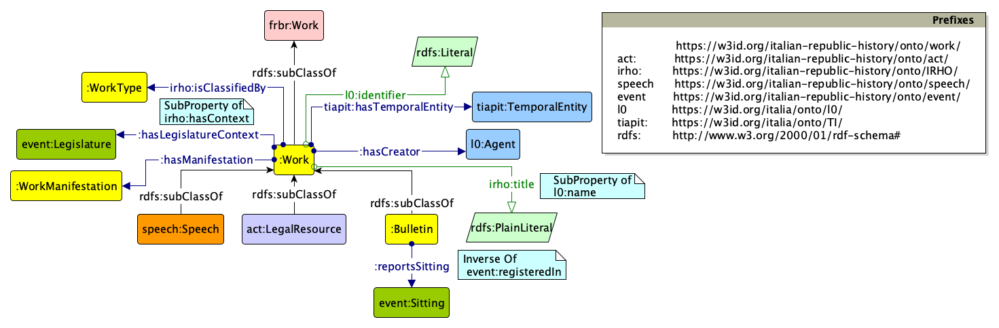
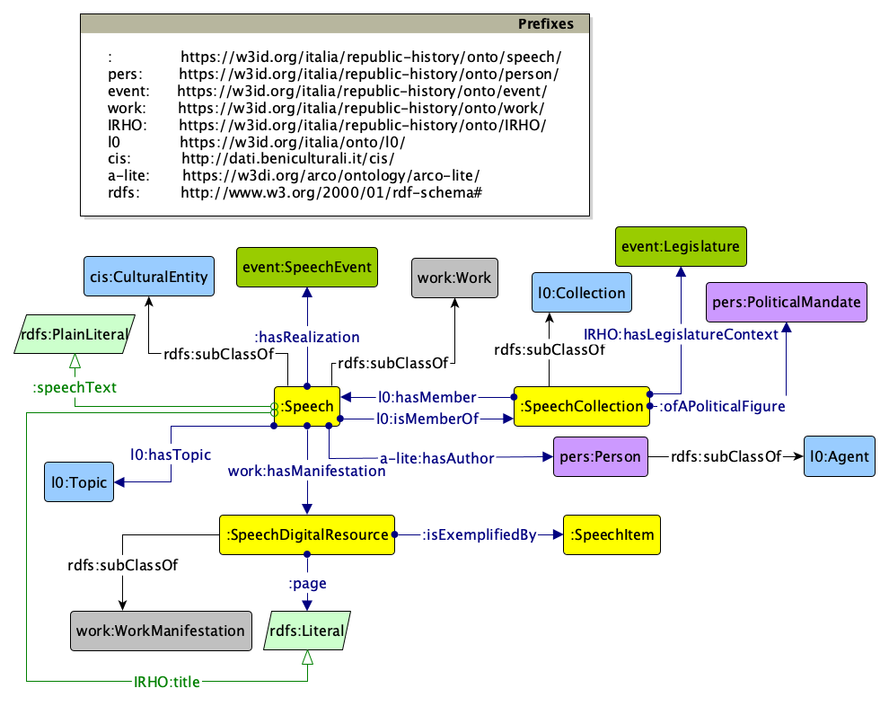
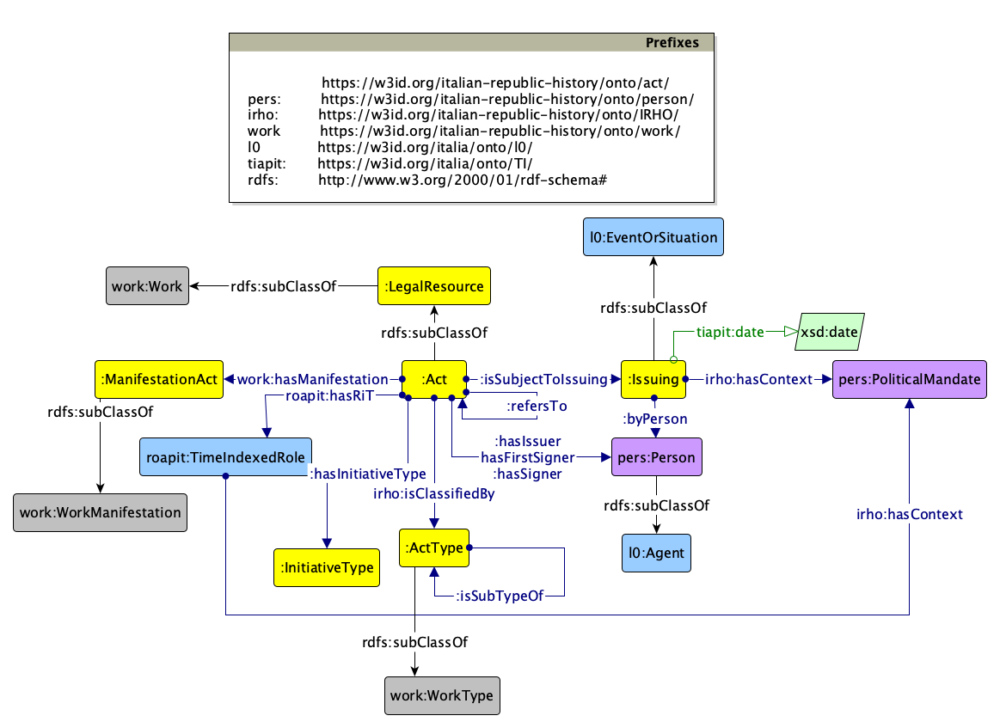
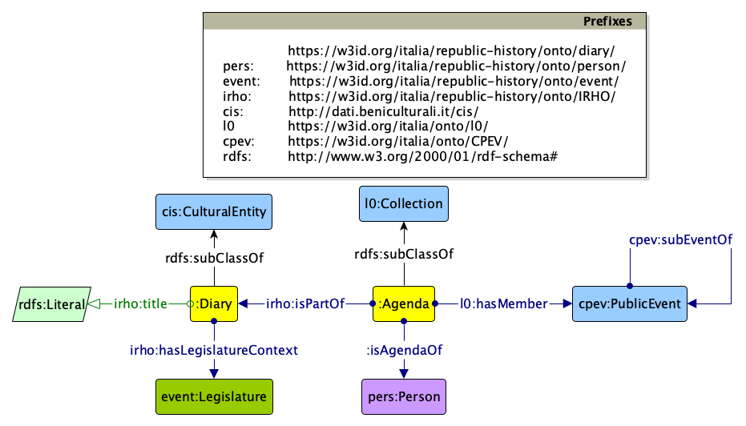
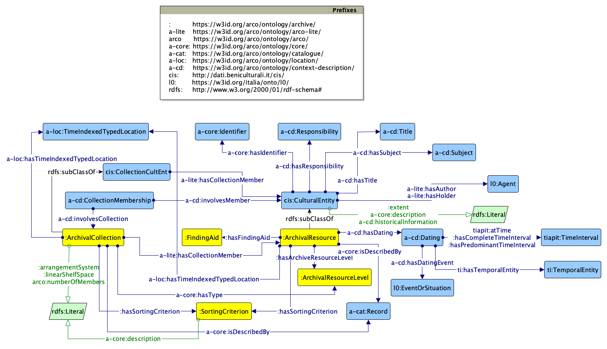

**Scegli la lingua / Choose your language**

[](README.md)
[](README.en.md)

# Risorse semantiche per il *Portale delle fonti per la storia della Repubblica italiana*


## Introduzione

Questo repository ospita i **moduli ontologici** che compongono la **rete di ontologie** progettata e sviluppata nell'ambito dell'iniziativa per la realizzazione del [Portale delle fonti per la storia della Repubblica italiana](https://portalefontirepubblicaitaliana.cnr.it/).

Il portale si basa su dati strutturati in un **grafo della conoscenza** semantico, secondo il paradigma dei Linked Open Data. La rete di ontologie definisce i modelli semantici di riferimento per la rappresentazione e l'interconnessione di persone, organizzazioni, eventi, risorse archivistiche e di tutte le altre entità di interesse per il dominio di riferimento. Tali modelli costituiscono la base semantica del grafo della conoscenza del portale, favorendo l'integrazione dei dati provenienti da fonti eterogenee e la loro pubblicazione come **Linked Open Data**.

### Il Portale

Il [Portale delle fonti per la storia della Repubblica italiana](https://portalefontirepubblicaitaliana.cnr.it/) è un progetto coordinato dal **Consiglio Nazionale delle Ricerche (CNR)**, finalizzato alla realizzazione di un'infrastruttura digitale interoperabile basata su standard aperti per l'aggregazione, l'integrazione e la valorizzazione di un corpus distribuito ed eterogeneo di risorse che documentano la storia politica e istituzionale dell'Italia repubblicana.

Il portale integra e rende interoperabili tali risorse mediante una rete di ontologie di riferimento, consentendone la fruizione nel contesto degli archivi pubblici e privati che conservano fonti relative alla storia della Repubblica italiana. Le informazioni pubblicate sono strutturate in formato _machine-readable_ e interoperabile, e comprendono, oltre a diverse risorse archivistiche e documentali, entità correlate quali organizzazioni, atti normativi e altri elementi utili a ricostruire il contesto politico e istituzionale in cui tali fonti sono state prodotte.

### Principali fonti di dati

Diverse istituzioni e amministrazioni pubbliche — tra cui l'Archivio Storico della Presidenza della Repubblica, l'Archivio Storico del Senato della Repubblica, l'Archivio Storico della Camera dei deputati e l'Archivio Centrale dello Stato — insieme a un gruppo di fondazioni e istituti culturali aderenti all'*Associazione delle Istituzioni di Cultura Italiane* ([AICI](https://www.aici.it/)), hanno reso disponibili portali, banche dati e sistemi informativi contenenti descrizioni, riproduzioni digitali e dati di dominio relativi ai propri patrimoni archivistici, anche come Linked Open Data. Tali risorse hanno costituito la principale base di riferimento per la progettazione dei modelli ontologici e per l'alimentazione del grafo della conoscenza che supporta il portale.

Tra i principali portali di dati che hanno contribuito alla definizione delle ontologie e che rappresentano fonti di riferimento per specifici domini del grafo della conoscenza del portale si segnalano:

* [Il portale Open Data dell'Archivio Storico della Presidenza della Repubblica](https://archivio.quirinale.it/aspr/)
* [Il portale Open Data della Camera dei Deputati](https://dati.camera.it/en)
* [Il portale Open Data del Senato della Repubblica](https://dati.senato.it/)
* [Il portale Open Data dell'Archivio Centrale dello Stato](http://dati.acs.beniculturali.it/)
* [La piattaforma GECA per la catalogazione e descrizione del patrimonio culturale](https://geca.imati.cnr.it/make_home_page.php?status=backhome&language=ITA)


## Struttura del repository

Questo repository è organizzato per supportare l'intero ciclo di vita delle ontologie, dalla progettazione alla pubblicazione e manutenzione. I moduli ontologici seguono un approccio modulare e un sistema di versionamento esplicito, finalizzati a garantire la retrocompatibilità e la stabilità degli URI degli elementi che compongono la rete di ontologie.

```text
assets/
└── ontologies/                  # Riferimento per i moduli ontologici definiti in OWL
    ├── [module-name]/           # IRHO, person, event, diary, ecc.
    │   ├── v0.1/                # Snapshot con specifica versione
    │   ├── v0.2/
    │   ├── ...
    │   ├── latest/              # Copia dell'ultima versione stabile
    │   │   ├── module.owl       # Serializzazione OWL RDF/XML 
    │   │   ├── module.rdf       # Serializzazione RDF/XML
    │   │   └── module.ttl       # Serializzazione Turtle
    │   └── Grafici/             
    │       ├── module.graphml   # Sorgente del diagramma Graffoo
    │       └── module.png       # Diagramma Graffoo
    └── ...
```

📂 [`ontologies/`](./ontologies)

Costituisce il nucleo del repository e contiene i **moduli ontologici**. Ogni modulo è organizzato per versioni. La directory `latest/` contiene sempre la versione stabile più recente dell'ontologia, resa disponibile in diverse serializzazioni RDF (ad esempio Turtle e RDF/XML).

Per ciascun modulo sono inoltre fornite rappresentazioni grafiche realizzate come diagrammi [Graffoo](https://essepuntato.it/graffoo/). Tali diagrammi descrivono formalmente classi, proprietà e assiomi delle ontologie, e costituiscono il principale riferimento visuale per la comprensione della struttura concettuale dei modelli.

## La rete di ontologie

La rete ontologica del portale è progettata come un insieme modulare di ontologie interconnesse, in grado di garantire una chiara separazione dei domini rappresentati, pur mantenendo una visione unificata dei diversi ambiti di conoscenza e dei relativi dati di dominio. L'architettura semantica adotta un approccio multilivello, che bilancia la modellazione di specifica conoscenza di dominio con l'interoperabilità tra domini diversi e il riuso di ontologie esistenti.



### Italian Republic History Ontology (IRHO)

**URI**: [`https://w3id.org/italia/republic-history/onto/IRHO`](https://w3id.org/italia/republic-history/onto/IRHO)

La *Italian Republic History Ontology* (IRHO) costituisce l'ontologia centrale della rete e ne rappresenta il principale punto di accesso. Essa importa e integra tutti i moduli ontologici sviluppati nell'ambito del progetto, fornendo una vista unificata dell'intero ecosistema semantico. L'ontologia definisce inoltre un insieme di classi e proprietà trasversali ai diversi domini applicativi, riutilizzate dall'intera rete. Tra queste rientrano proprietà descrittive generali, quali il titolo, il nome breve e altri elementi comuni utilizzati per caratterizzare le risorse.

Il resto della rete ontologica è organizzato in moduli tematici che riflettono le principali dimensioni informative del dominio di riferimento.

### Ontologia delle persone (di rilevanza pubblica)

**URI**: [`https://w3id.org/italia/republic-history/onto/person`](https://w3id.org/italia/republic-history/onto/person)



Questa ontologia modella le persone di rilevanza pubblica, con particolare riferimento ai soggetti che ricoprono o hanno ricoperto incarichi di natura politica o istituzionale. Il modello consente di rappresentare ruoli, cariche e posizioni mediante l'applicazione di consolidati pattern di modellazione ontologica, in continuità con quelli adottati da altre ontologie di riferimento del panorama nazionale.

Il modulo supporta una rappresentazione strutturata e riusabile delle appartenenze e degli incarichi nel tempo, consentendo di descrivere il legame tra una persona, il ruolo ricoperto e l'organizzazione — in particolare politica o istituzionale — nell'ambito della quale tale ruolo viene esercitato.

### Ontologia delle organizzazioni (politiche)

**URI**: [`https://w3id.org/italia/republic-history/onto/org`](https://w3id.org/italia/republic-history/onto/org)



Questa ontologia modella le diverse tipologie di organizzazioni rilevanti nel contesto politico e istituzionale della Repubblica italiana, includendo entità quali partiti politici, gruppi parlamentari e altri soggetti che svolgono un ruolo nell'ordinamento costituzionale e nella vita pubblica del Paese.

Il modulo fornisce una rappresentazione strutturata delle caratteristiche e delle classificazioni di tali organizzazioni, consentendo di descriverne il ruolo all'interno del sistema politico e istituzionale e di supportarne l'integrazione con gli altri domini della rete ontologica.

### Ontologia degli eventi pubblici

**URI**: [`https://w3id.org/italia/republic-history/onto/event`](https://w3id.org/italia/republic-history/onto/event)





Questa ontologia riusa e specializza l'ontologia nazionale CPEV per la rappresentazione degli eventi rilevanti nel dominio applicativo del progetto. Il modello consente di descrivere eventi di natura istituzionale e politica quali l'elezione e l'insediamento del Presidente della Repubblica, le sedute parlamentari, gli interventi, i dibattiti e altre manifestazioni pubbliche di interesse storico e documentario.

Il modulo fornisce inoltre le strutture semantiche necessarie per rappresentare la partecipazione di persone e organizzazioni agli eventi, nonché le relazioni tra gli eventi stessi e le altre entità della rete ontologica.

### Ontologia delle opere (creative work)

**URI**: [`https://w3id.org/italia/republic-history/onto/work`](https://w3id.org/italia/republic-history/onto/work)



Questo modulo ontologico si colloca come meta-livello, finalizzato a raggruppare concetti più astratti prevalentemente derivati dal modello FRBR (*Functional Requirements for Bibliographic Records*), con il quale è semanticamente allineato.

L’ontologia copre entità riconducibili alle opere creative e alle risorse documentarie prodotte da attori istituzionali, nonché alle loro realizzazioni materiali. In particolare, fornisce la struttura semantica per l’organizzazione e la connessione di risorse specifiche del dominio, quali bollettini parlamentari, discorsi presidenziali e atti giuridicamente vincolanti, inclusi leggi e altri documenti normativi.

### Ontologia dei discorsi

**URI**: [`https://w3id.org/italia/republic-history/onto/speech`](https://w3id.org/italia/republic-history/onto/speech)



Questa ontologia modella i discorsi pronunciati da individui all’interno di specifici eventi e contesti istituzionali. Consente inoltre la rappresentazione delle risorse digitali associate, intese come manifestazioni materiali dei discorsi stessi.

Il modulo supporta l’interconnessione strutturata tra oratori, eventi e contenuti dei discorsi, garantendo una rappresentazione semantica coerente delle relazioni tra questi elementi.

### Ontologia degli atti normativi

**URI**: [`https://w3id.org/italia/republic-history/onto/act`](https://w3id.org/italia/republic-history/onto/act)



Questa ontologia modella gli atti legislativi e le leggi, includendo tutte le informazioni rilevanti relative al loro processo di emanazione, quali il contesto, il periodo temporale e i soggetti coinvolti.

Il modello introduce il concetto di *Risorsa giuridica* (*Legal Resource*), allineato all’ontologia dello *European Legislation Identifier* (ELI), utilizzata per la definizione di identificatori persistenti nelle pubblicazioni ufficiali di carattere normativo, come la *Gazzetta Ufficiale*. Una risorsa giuridica può rappresentare anche una componente di un atto normativo più ampio, ad esempio un singolo articolo di una legge, consentendo una rappresentazione granulare della struttura degli atti legislativi.

### Ontologia dei diari

**URI**: [`https://w3id.org/italia/republic-history/onto/diary`](https://w3id.org/italia/republic-history/onto/diary)



Questa ontologia modella i diari storici e i relativi materiali documentari, come ad esempio i diari dei Presidenti della Repubblica. Il diario è trattato come un’entità di patrimonio culturale composta da un’agenda, intesa come una raccolta strutturata di eventi pubblici.

Il modulo supporta la rappresentazione dei diari come oggetti culturali curati, in grado di mettere in relazione record temporali e attività istituzionali.

### Ontologia degli archivi

**URI**: [`https://w3id.org/arco/ontology/archive`](https://w3id.org/arco/ontology/archive)



L’ontologia degli archivi è pienamente integrata nella [rete ontologica ArCo](https://github.com/ICCD-MiBACT/ArCo), gestita dal Ministero della Cultura, e viene quindi mantenuta all’interno di tale ecosistema.

Attraverso il riuso dei componenti ontologici indipendenti dal dominio forniti da ArCo — quali date, luoghi e strutture di responsabilità — il modulo garantisce un forte allineamento semantico con gli standard nazionali per i beni culturali.

Il modello estende tale base con concetti specifici del dominio archivistico, tra cui `ArchivalResource`, `ArchivalResourceCollection` e la struttura gerarchica degli archivi, consentendo la rappresentazione strutturata delle entità archivistiche e della loro organizzazione interna.


## Accesso al Knowledge Graph e Linked Open Data

La rete ontologica costituisce la base formale per la produzione e pubblicazione di Linked Open Data per il [portale](https://portalefontirepubblicaitaliana.cnr.it/). I modelli ontologici sono stati utilizzati per trasformare e armonizzare dataset eterogenei in formato RDF interrogabile e *machine-readable*.

Le ontologie supportano la costruzione di un **grafo della conoscenza semantico**, che integra dati provenienti da fonti multiple in una rappresentazione coerente e interoperabile. Il knowledge graph risultante costituisce l'infrastruttura informativa centrale del portale, abilitando funzionalità di ricerca semantica, integrazione dei dati, entity linking e l’esplorazione di relazioni complesse tra risorse archivistiche, fonti storiche e relativi contesti.

In questo modo, il grafo della conoscenza abilita le funzionalità di scoperta, navigazione e interoperabilità del portale, consentendo a utenti e applicazioni di esplorare in modo unitario le relazioni tra documenti, istituzioni, persone, luoghi ed eventi storici.

### Endpoint SPARQL

Il grafo della conoscenza è interrogabile tramite l'endpoint SPARQL del progetto:

* **Endpoint SPARQL**: [`https://portalefontirepubblicaitaliana.cnr.it/sparql`](https://portalefontirepubblicaitaliana.cnr.it/sparql)
* **Interfaccia di interrogazione SPARQL** (Yasgui): [`https://portalefontirepubblicaitaliana.cnr.it/sparql-ui`](https://portalefontirepubblicaitaliana.cnr.it/sparql-ui)

Il portale mette inoltre a disposizione [query di esempio](https://portalefontirepubblicaitaliana.cnr.it/portal/esplora_dati.php), utilizzabili come punto di partenza per esplorare i dati RDF disponibili e interagire con l'endpoint SPARQL.

## Esempi di entità nel grafo della conoscenza

### 👥 Persone

| Nome | URI |
| :--- | :--- |
| Luigi Einaudi     | [`https://w3id.org/italia/republic-history/data/political-figure/cp27790`](https://w3id.org/italia/republic-history/data/political-figure/cp27790) |
| Alcide De Gasperi | [`https://w3id.org/italia/republic-history/data/political-figure/cp13230`](https://w3id.org/italia/republic-history/data/political-figure/cp13230) |
| Palmiro Togliatti | [`https://w3id.org/italia/republic-history/data/political-figure/cp14140`](https://w3id.org/italia/republic-history/data/political-figure/cp14140) |
| Giorgio Almirante | [`https://w3id.org/italia/republic-history/data/political-figure/cp140`](https://w3id.org/italia/republic-history/data/political-figure/cp140)     |

### 🏛️ Organizzazioni politiche

| Nome | URI |
| :--- | :--- |
| Assemblea Costituente | [`https://w3id.org/italia/republic-history/data/assembly/ca`](https://w3id.org/italia/republic-history/data/assembly/ca)                         |
| Senato della Repubblica        | [`https://w3id.org/italia/republic-history/data/constitutional-body/sdr`](https://w3id.org/italia/republic-history/data/constitutional-body/sdr) |
| Primo governo De Gasperi       | [`https://w3id.org/italia/republic-history/data/cabinet/G065G`](https://w3id.org/italia/republic-history/data/cabinet/G065G)                     |

### 🗓️ Eventi

| Nome | URI |
| :--- | :--- |
| Elezione di Luigi Einaudi a Presidente della Repubblica    | [`https://w3id.org/italia/republic-history/data/presidential-election/cp27790-1948-05-11`](https://w3id.org/italia/republic-history/data/presidential-election/cp27790-1948-05-11)   |
| Elezione di Enrico De Nicola a Presidente della Repubblica | [`https://w3id.org/italia/republic-history/data/presidential-election/cp303409-1946-06-28`](https://w3id.org/italia/republic-history/data/presidential-election/cp303409-1946-06-28) |

### 🗃️ Risorse archivistiche e entità correlate

| Nome | URI |
| :--- | :--- |
| Archivio Storico della Presidenza della Repubblica | [`https://w3id.org/italia/republic-history/data/holder-of-archive/hist-001-000001`](https://w3id.org/italia/republic-history/data/holder-of-archive/hist-001-000001) |
| Fondo Francesco Bartolotta                         | [`https://w3id.org/italia/republic-history/data/arc-resource/IT_GEC_BAL_00000001`](https://w3id.org/italia/republic-history/data/arc-resource/IT_GEC_BAL_00000001)   |
| Fondo Repubblica sociale italiana                  | [`https://w3id.org/italia/republic-history/data/arc-resource/IT_GEC_BAL_00000006`](https://w3id.org/italia/republic-history/data/arc-resource/IT_GEC_BAL_00000006)   |
| Risorsa archivistica Nino Tripodi                  | [`https://w3id.org/italia/republic-history/data/arc-resource/IT_GEC_BAL_00000002`](https://w3id.org/italia/republic-history/data/arc-resource/IT_GEC_BAL_00000002)   |
| Fondo Raccolta ufficiale delle leggi e dei decreti | [`https://w3id.org/italia/republic-history/data/arc-resource/IT_GEC_BAL_00000037`](https://w3id.org/italia/republic-history/data/arc-resource/IT_GEC_BAL_00000037)   |


## Namespace e URI di base

Per garantire persistenza, stabilità e risoluzione a lungo termine degli URI, il progetto utilizza l'infrastruttura [w3id](https://w3id.org/). Tutte le risorse pubblicate nell’ecosistema del *Portale delle fonti per la storia della Repubblica italiana* condividono il seguente URI di base:

* `https://w3id.org/italia/republic-history/`

Questo URI di base è ulteriormente articolato in *namespace* dedicati alle ontologie e alle risorse del grafo della conoscenza:

* Ontologie: `https://w3id.org/italia/republic-history/onto/`
* Entità e risorse del grafo della conoscenza: `https://w3id.org/italia/republic-history/data/`

Tutti gli URI sono progettati per essere persistenti e dereferenziabili, supportando sia la documentazione in formato leggibile dall’uomo (tramite strumenti come [LODE](https://essepuntato.it/lode/) e [LodView](https://github.com/LodLive/LodView)) sia le rappresentazioni RDF *machine-readable*, in conformità ai principi dei Linked Data.

## Contributi e segnalazioni

Siamo aperti ai contributi da parte di esperti di dominio e della comunità del Semantic Web per il miglioramento della rete ontologica. È possibile contribuire segnalando errori o inconsistenze, proponendo nuovi termini o suggerendo estensioni e miglioramenti dei modelli.

Per garantire tracciabilità e trasparenza, si incoraggia l'utilizzo di **GitHub Issues** come canale principale di comunicazione.

* **Segnalazione di bug:** hai riscontrato un’incoerenza in un modulo OWL o un link non funzionante?
* **Proposte di miglioramento:** hai suggerimenti per rendere più descrittiva una proprietà o introdurre una nuova classe?
* **Richieste di funzionalità:** hai bisogno di un’estensione per supportare un caso d’uso specifico?

Per contribuire o porre domande, è possibile **[aprire una nuova issue](https://github.com/PortaleFontiRepubblica/assets/issues/new/choose)** in questo repository, fornendo tutti i dettagli necessari.

## Governance e manutenzione

Le ontologie presenti in questo repository sono state progettate e sviluppate dal Consiglio Nazionale delle Ricerche (CNR), attraverso la collaborazione tra:

* **Istituto di Scienze e Tecnologie della Cognizione** ([CNR-ISTC](https://www.istc.cnr.it)), responsabile principale della progettazione ontologica e del processo di knowledge engineering
* **Istituto per le Applicazioni del Calcolo “Mauro Picone”** ([CNR-IMATI](https://www.imati.cnr.it))
* **Istituto per il Lessico Intellettuale Europeo e Storia delle Idee** ([CNR-ILIESI](https://www.iliesi.cnr.it))

Per garantire che tali risorse rimangano una base affidabile per la comunità:

* **Manutenzione a lungo termine:** il CNR si impegna a garantire la manutenzione e la sostenibilità delle risorse semantiche oltre il ciclo di vita del progetto iniziale.
* **Persistenza degli URI:** tutti i namespace e gli identificatori sono gestiti per garantire la risoluzione permanente nell’ecosistema Linked Data, tramite il servizio [w3id.org](https://w3id.org/) e il relativo sottodominio [italia](https://github.com/perma-id/w3id.org/tree/master/italia), dedicato a ontologie e vocabolari controllati della Pubblica Amministrazione italiana.
* **Supporto istituzionale:** in quanto ente ospitante del portale, il CNR garantisce la stabilità istituzionale necessaria al mantenimento dell’infrastruttura.

## Licenza


I moduli ontologici e la relativa documentazione sono rilasciati sotto licenza [Creative Commons Attribution 4.0 International (CC BY 4.0)](https://creativecommons.org/licenses/by/4.0/).
