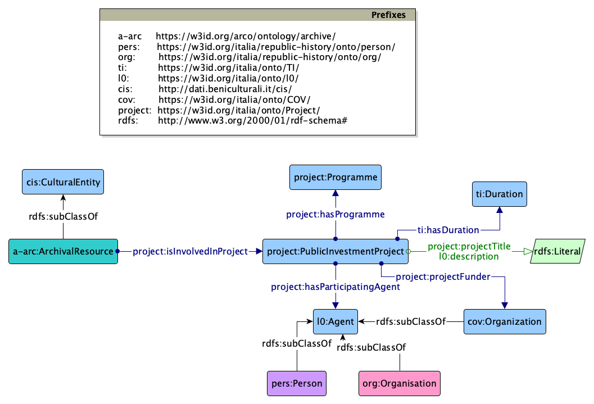

# L'ontologia dei progetti

A differenza degli altri moduli ontologici, per l'ontologia dei progetti, il progetto portale delle fonti riutilizza completamente l'ontologia dei progetti già disponibile a livello nazionale nella rete OntoPiA e nel catalogo schema.gov.it.

Il riutilizzo è documentato dal seguente diagramma rappresentato con la notazione grafica Graffoo.

